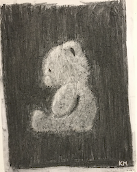
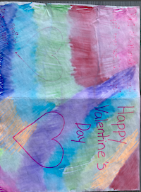
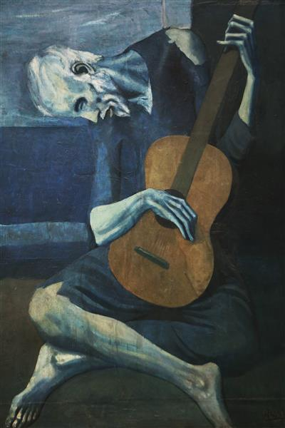

# Analyzing Mental Health Images with Claude 3.5 Sonnet 
Peeking Beyond the Canvas: Analyzing Mental Health through Images with Claude 3.5 Sonnet (released 20June2024)

- Dare to dream
- Ignite your inspiration and innovation
- Strive for excellence
- Explore together & unlock the world's knowledge

## Peeking Beyond the Canvas: Analyzing Mental Health through Images with Claude 3.5 Sonnet

_Prompt: As a psychiatrist, psychologist, and therapist in the healthcare profession, reflect on what the artist reveals about their psychological state. Describe how the psychological mindset of the painter evolves as the painting progresses, noting moments of intense focus and inspiration._

---------------------------------------------------------------

### <ins>First Run with Claude 3.5 Sonnet Response:</ins>

As a healthcare professional observing this artist's work, I would empathize with the emotional journey depicted in this charcoal drawing. The image shows a lone teddy bear emerging from a dark background, which could symbolize feelings of isolation, nostalgia, or a search for comfort.

Regarding the Big Five Personality Traits:

1. Openness: The artist appears to have a high level of openness, as evidenced by their willingness to explore emotional themes through art and use symbolic representation.

2. Conscientiousness: The detailed rendering of the teddy bear against a stark background suggests a methodical approach, indicating conscientiousness in their work.

3. Extraversion: The solitary nature of the subject might hint at a lower level of extraversion, possibly reflecting an introverted tendency or a need for introspection.

4. Agreeableness: The choice of a soft, comforting subject like a teddy bear could indicate a gentle, agreeable nature.

5. Neuroticism: The contrast between the dark background and the light figure might suggest some level of emotional complexity or sensitivity.

Clinical observations and potential conversation starters:

1. "The contrast in your work is striking. Can you tell me about the emotions you were experiencing while creating this piece?"

2. "The teddy bear seems to emerge from darkness. Does this reflect any personal experiences or feelings you'd like to explore?"

3. "Your choice of a childhood object is interesting. How does nostalgia or past experiences influence your art and emotional state?"

4. "The simplicity of the composition draws focus to the teddy bear. What does this figure represent to you?"

5. "Creating art can be a form of emotional expression. How does your artistic process affect your mood and well-being?"

These observations and questions aim to open a dialogue about the artist's emotional state, creative process, and how their art reflects their inner world, providing a foundation for a therapeutic conversation.

### <ins>Second Run with Claude 3.5 Sonnet Response:</ins>

As a healthcare professional, I would approach empathizing with this artist by recognizing the emotional depth and vulnerability expressed in their work. The image presented shows a simple, yet evocative charcoal drawing of what appears to be a stuffed animal or teddy bear, set against a dark background. This choice of subject and medium can be indicative of the artist's inner world and emotional state.

To empathize with the artist, I would acknowledge the courage it takes to express oneself through art, especially when dealing with themes that might evoke childhood memories or feelings of vulnerability. The contrast between the soft, comforting image of the teddy bear and the dark surroundings could represent the artist's struggle with finding comfort in a challenging environment.

Regarding the Big Five Personality Traits:

1. Openness: The artist likely scores high in this trait, as evidenced by their willingness to explore emotional themes through creative expression.

2. Conscientiousness: The attention to detail in the shading and texture of the bear suggests a moderate to high level of conscientiousness.

3. Extraversion: Without more context, it's difficult to determine. The solitary nature of the subject might hint at a more introverted personality, but this is not conclusive.

4. Agreeableness: The choice of a comforting childhood object might indicate a gentle, agreeable nature, but more information would be needed to confirm this.

5. Neuroticism: The stark contrast and isolated subject could suggest some level of emotional sensitivity or anxiety, potentially indicating a higher score in neuroticism.

Clinical observations and potential conversation starters:

1. "I notice you've chosen to depict a childhood object. Can you tell me more about what this teddy bear represents to you?"

2. "The contrast between the soft bear and the dark background is striking. How does this reflect your current emotional state or life experiences?"

3. "Art can be a powerful tool for self-expression. How does creating this piece make you feel during and after the process?"

4. "The teddy bear appears to be looking up or to the side. What perspective or emotion were you trying to capture with this posture?"

5. "Black and white art can convey a range of emotions. What led you to choose this medium for this particular piece?"

These observations and questions could serve as a starting point for a deeper exploration of the artist's emotional state, personal history, and current life challenges, allowing for a more comprehensive understanding and tailored therapeutic approach.

------------------------------------------------------

### <ins>First Run with Claude 3.5 Sonnet Response:</ins>

As a mental health professional, I would approach this artist with empathy and curiosity about their creative process. The painting you've shared reveals a vibrant and expressive use of color, suggesting an emotional and intuitive approach to art-making. 

Empathizing with the artist, I would acknowledge the range of emotions that seem to be present in their work. The soft, blended colors might represent periods of calm and reflection, while the bolder strokes and contrasts could indicate moments of intense feeling or inspiration. The inclusion of words like "Happy" and "Harmony's" along with a heart shape suggests a desire to express positive emotions and connect with others through their art.

Regarding the Big Five Personality Traits:

1. Openness: The artist likely scores high in this trait, given the experimental and abstract nature of the painting. They seem open to exploring various colors and textures in their work.

2. Conscientiousness: This is harder to determine from a single piece, but the attention to blending colors and incorporating text shows some level of deliberation in their process.

3. Extraversion: The use of bright colors and positive words might suggest an extraverted tendency, or at least a desire to communicate outwardly through their art.

4. Agreeableness: The inclusion of positive words and symbols like "Happy" and a heart shape could indicate a warm, agreeable nature.

5. Neuroticism: Without more context, it's difficult to assess this trait. However, the overall positive tone of the piece doesn't immediately suggest high neuroticism.

Clinical observations and potential conversation starters:

1. "I notice you've used a range of colors in this piece. Can you tell me about how you choose your colors and what they mean to you?"

2. "The words 'Happy' and 'Valentine' appear in your painting. How do these concepts relate to your emotional state while creating art?"

3. "Your painting style seems very fluid and expressive. How does your mood influence your artistic process?"

4. "Do you find that creating art helps you process your emotions? If so, how?"

5. "I'm curious about the heart shape in your painting. What does it represent for you in this context?"

These observations and questions could serve as a starting point for a deeper exploration of the artist's emotional state, creative process, and how their art-making relates to their overall mental health and well-being.

### <ins>Second Run with Claude 3.5 Sonnet Response:</ins>

As a healthcare professional, I would empathize with this artist by recognizing the emotional journey reflected in their painting process. The image shows a vibrant, colorful abstract piece with soft, blended hues and a heart shape, suggesting an emotional and expressive approach to art.

Regarding the Big Five Personality Traits:

1. Openness: The artist appears high in openness, as evidenced by the abstract nature of the work and the use of diverse colors. This suggests creativity and a willingness to explore new ideas.

2. Conscientiousness: The blending of colors and the inclusion of text indicate some level of planning and attention to detail, suggesting moderate conscientiousness.

3. Extraversion: The bright colors and expressive nature of the piece might indicate a moderate to high level of extraversion, as the artist seems to be outwardly expressing their emotions.

4. Agreeableness: The soft color transitions and the inclusion of positive words like "Happy" and "Kindness" suggest a high level of agreeableness.

5. Neuroticism: The balanced composition and positive messaging indicate low to moderate neuroticism, as the artist seems to be in a relatively stable emotional state.

Clinical observations and conversation starters:

1. "I notice you've used a variety of colors in your work. How do these colors reflect your emotional state while creating this piece?"

2. "The heart shape and words like 'Happy' and 'Valentine's' are prominent. Can you tell me more about the significance of these elements in your life?"

3. "How does the process of creating art like this impact your overall mood and well-being?"

4. "I see a balance between structure and fluidity in your work. How do you navigate between planning and spontaneity in your creative process?"

5. "The blending of colors suggests a sense of harmony. How do you find balance in other aspects of your life?"

These observations and questions could serve as starting points for a deeper exploration of the artist's psychological state, creative process, and overall well-being.

---------------------------------------------------------

_source: https://www.wikiart.org/en/pablo-picasso/the-old-blind-guitarist-1903_

### <ins>First Run with Claude 3.5 Sonnet Response:</ins>

As a mental health professional, I would empathize with the artist by recognizing the profound emotional depth and introspection evident in this painting. The artwork reveals a complex psychological state, combining elements of melancholy, introspection, and perhaps a sense of isolation or alienation.

Regarding the Big Five Personality Traits (OCEAN), based on this artwork, I would hypothesize:

1. Openness: High. The abstract, emotive style suggests a vivid imagination and appreciation for unconventional artistic expression.

2. Conscientiousness: Moderate to high. The detailed execution of the painting indicates focus and dedication to their craft.

3. Extraversion: Low to moderate. The solitary, introspective nature of the subject might reflect a preference for solitude and inner contemplation.

4. Agreeableness: Moderate. While the somber mood might suggest lower agreeableness, the vulnerable portrayal could indicate empathy and emotional sensitivity.

5. Neuroticism: Moderate to high. The melancholic atmosphere and distorted figure suggest a tendency towards emotional intensity and possible anxiety or depression.

Clinical observations and potential conversation starters:

1. The blue tones dominating the painting might represent feelings of sadness or isolation. "Can you tell me about the emotions you were experiencing while creating this piece?"

2. The distorted figure holding the guitar could symbolize a struggle with self-image or identity. "How do you see yourself in relation to your art or music?"

3. The stark contrast between the figure and the instrument might represent a disconnect between the artist and their passion. "How does your relationship with music or art affect your emotional state?"

4. The hunched posture of the figure could indicate feelings of burden or weariness. "Do you often feel overwhelmed by your creative process or life in general?"

5. The empty space around the figure might represent feelings of loneliness or a sense of being misunderstood. "How do you feel about your connections with others in your life and artistic community?"

These observations could serve as starting points for a deeper exploration of the artist's emotional state, creative process, and overall mental well-being.

### <ins>Second Run with Claude 3.5 Sonnet Response:</ins>

As a mental health professional, I would approach empathizing with this artist by recognizing the depth of emotion and introspection evident in their work. The painting depicts a figure in a somber, melancholic state, holding a guitar. This suggests that the artist may be exploring themes of loneliness, introspection, and the relationship between art and emotional expression.

Regarding the Big Five Personality Traits:

1. Openness: The artist likely scores high in this trait, given the creative and unconventional nature of the painting. The use of blue tones and distorted proportions indicates a willingness to explore abstract concepts and emotions.

2. Conscientiousness: The detailed execution of the painting, particularly in the rendering of the guitar and the figure's hands, suggests a moderate to high level of conscientiousness.

3. Extraversion: The solitary, inward-focused nature of the subject might indicate a lower score in extraversion, as the artist seems to be exploring internal states rather than outward social interactions.

4. Agreeableness: This is harder to determine from the painting alone, but the melancholic mood might suggest a tendency towards introspection and empathy.

5. Neuroticism: The emotional intensity of the piece and its focus on what appears to be a state of sadness or contemplation could indicate a higher level of neuroticism or emotional sensitivity.

Clinical observations and potential conversation starters:

1. "The blue tones dominate the painting. Can you tell me about your choice of color and what it represents to you emotionally?"

2. "The figure's posture seems protective of the guitar. How do you view the relationship between the artist and their instrument or art?"

3. "There's a sense of isolation in this piece. How does solitude play a role in your creative process and emotional life?"

4. "The distorted proportions of the figure are striking. What were you trying to convey through this stylistic choice?"

5. "Music seems to be a central theme. How does music influence your emotional state and your art?"

These observations and questions could serve as starting points to explore the artist's emotional landscape, creative process, and how their art serves as a medium for self-expression and potentially, emotional regulation.

